# Smart Laboratory Management Portal

[](https://github.com/aliloay/smart-lab-portal/actions/workflows/ci.yml)

Booking, time-bound QR credentials, and the audit trail for the physical
two-factor access-control system.

Bachelor thesis — *Design and Development of an Intelligent IoT-Based Smart
Research Laboratory Management System*, German International University, Cairo.


## Features

- **Laboratory booking** across 11 laboratories, with live availability and conflict detection
- **Time-bound QR credentials**, valid only for one lab and only inside the booking window
- **Two-factor door access**: QR code or RFID card, then fingerprint or face recognition
- **Session traceability**: every booking reconstructs to the second — credential, both
  factors and their identities, result, entry, door cycle — and an exit only when one is observed
- **Maintenance workflow**: anyone can report a broken, missing or unsafe item with photos in
  about a minute; staff triage, assign, fix and record it, with a full audit timeline
- **Equipment lifecycle**: serial number, current holder, last inspection, next maintenance
  (overdue flagged), maintenance history and one timeline of each item's life
- **Access sessions**: any door event opens the session it belongs to - both factors, result,
  entry, door cycle, and an exit only when one was recorded
- **Simulation mode** for demonstrations without hardware, clearly labelled and entirely in the
  browser - it never writes to the audit trail
- **Role-specific experiences** for students, laboratory staff and administrators
- **Live operations**: authenticated WebSocket stream, device heartbeats with automatic
  offline alerts, and in-portal notifications
- **Operations Center**: utilisation heatmaps, access funnel, refusal reasons, sessions,
  device outage history, maintenance flow vs SLA, environment and automation status - all
  counted from recorded rows, with explicit empty states instead of invented values
- **n8n automation (optional)**: a transactional event outbox and a key-protected automation
  API drive 12 workflows (reminders, denial bursts, offline escalation, reports, data quality,
  rule-based anomalies...). n8n never touches the door - see [AUTOMATION.md](docs/AUTOMATION.md)
- **AI lab assistant (optional)**: staff ask questions in plain language ("which lab has the
  most no-shows?"). Answers come from the portal's own records through read-only tools. Also
  a ranked "what to fix first" maintenance list, week-over-week trends and CSV/PDF export -
  see [AI_ASSISTANT.md](docs/AI_ASSISTANT.md)
- **Full audit trail** of every attempt, with the reason it was allowed or refused, exportable to CSV
- **Fails closed**: if the backend is down, a booking QR opens nothing

## Screenshots

Demo data. The door events are simulated through the same device API the ESP32
master uses. Laboratory images are illustrations of each discipline, not
photographs of the rooms.

| Sign in | Student dashboard |
|---|---|
| 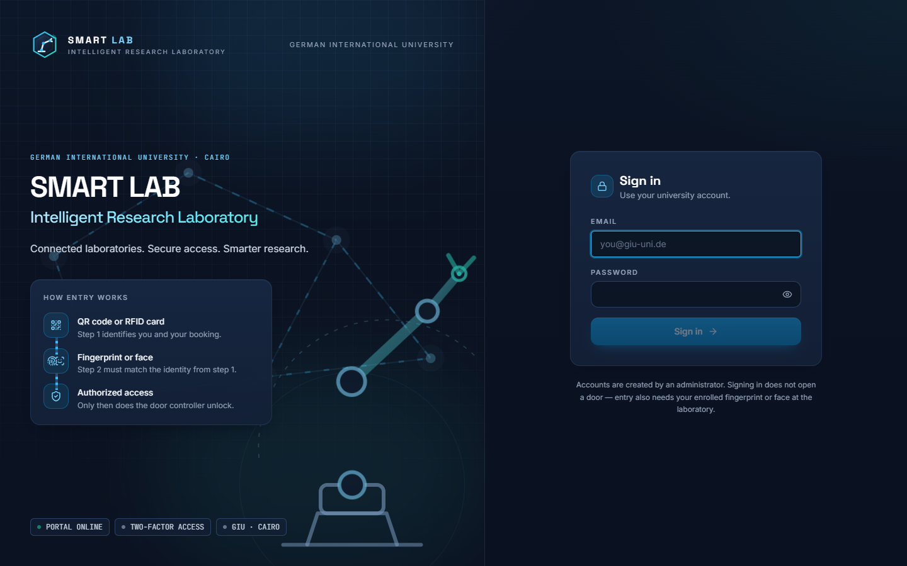 | 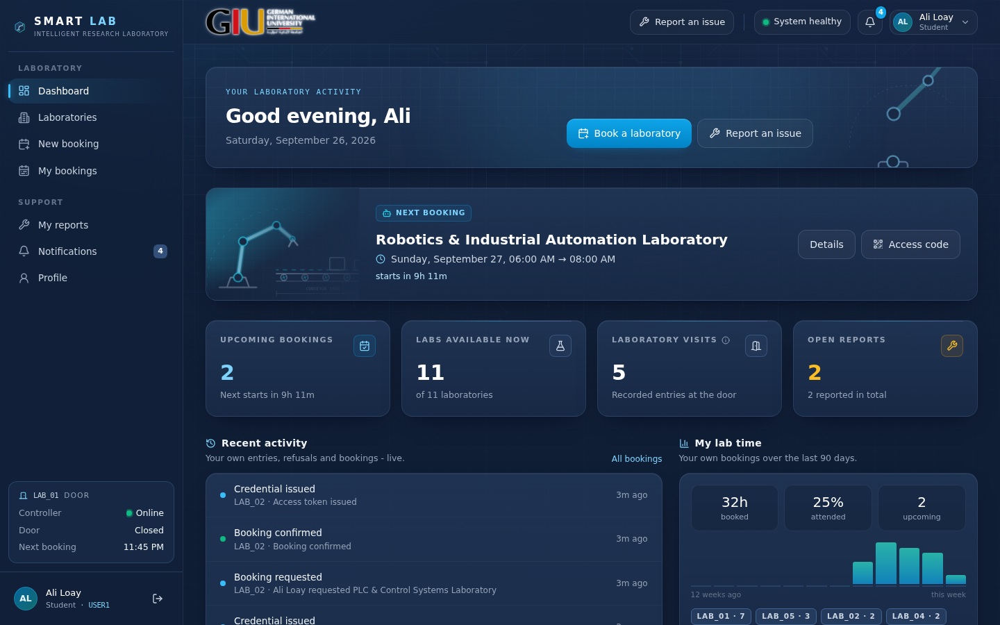 |
| **Laboratory network** | **A laboratory's control panel** |
| 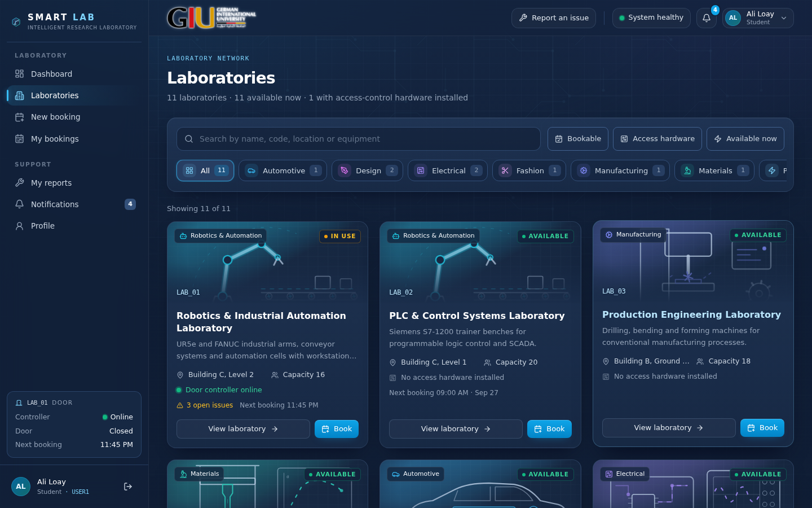 | 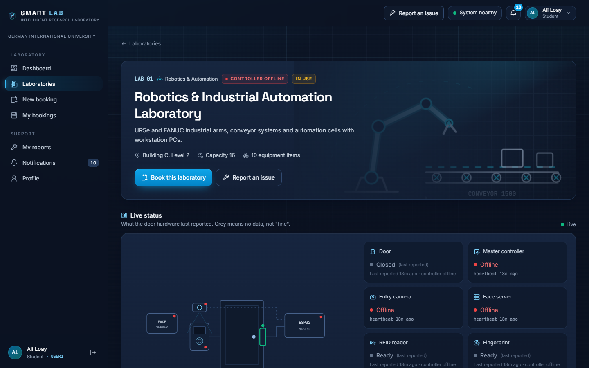 |
| **Booking traced end to end** | **Time-bound access QR** |
| 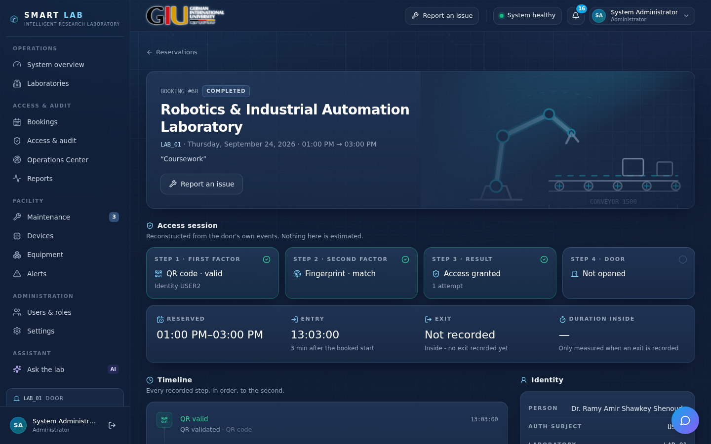 | 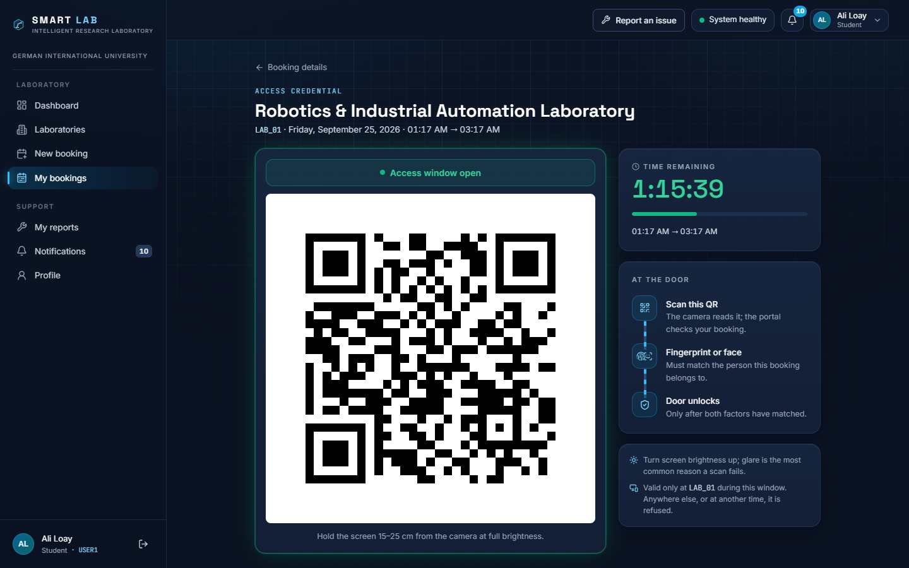 |
| **Report an issue** | **Maintenance queue** |
| 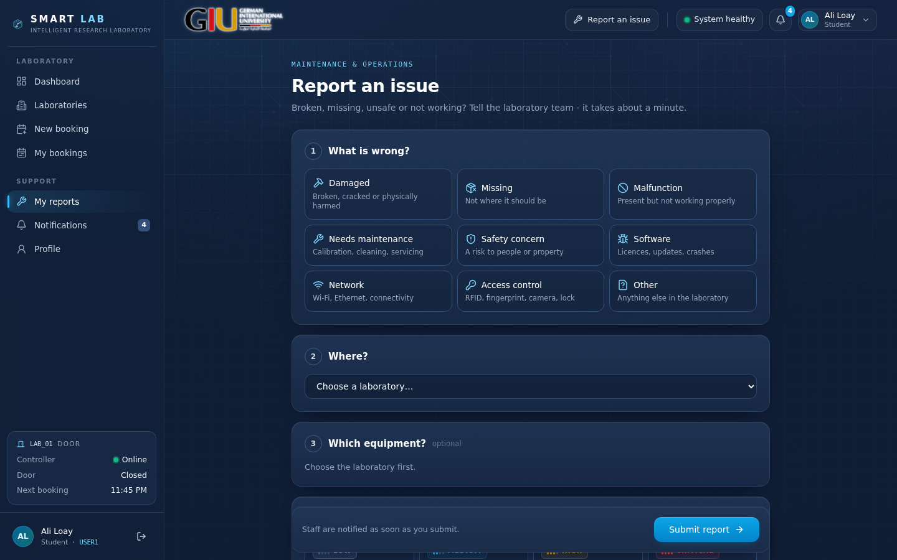 | 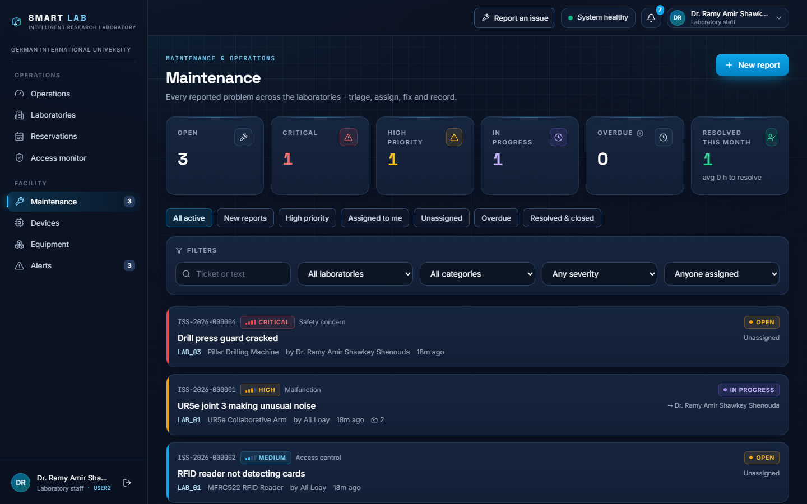 |
| **Issue workflow** | **Access monitor** |
| 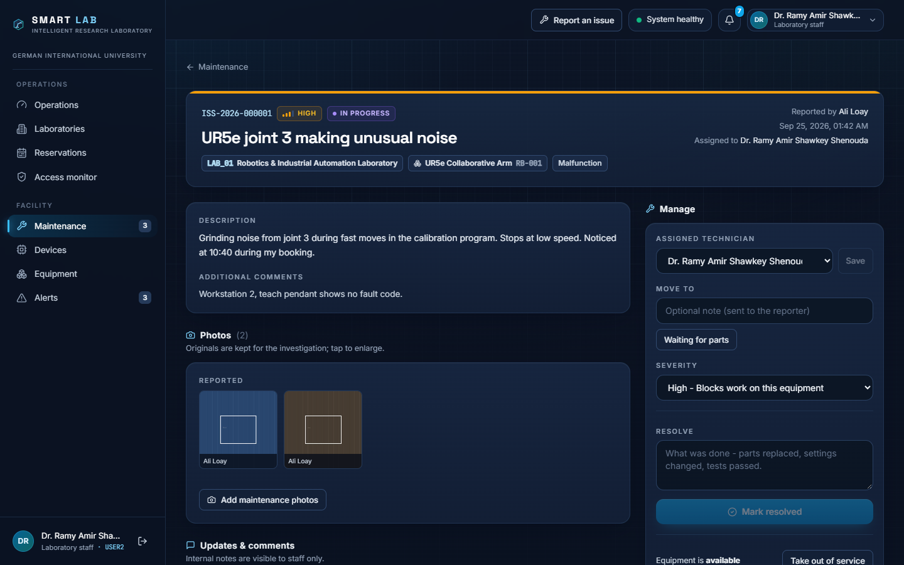 | 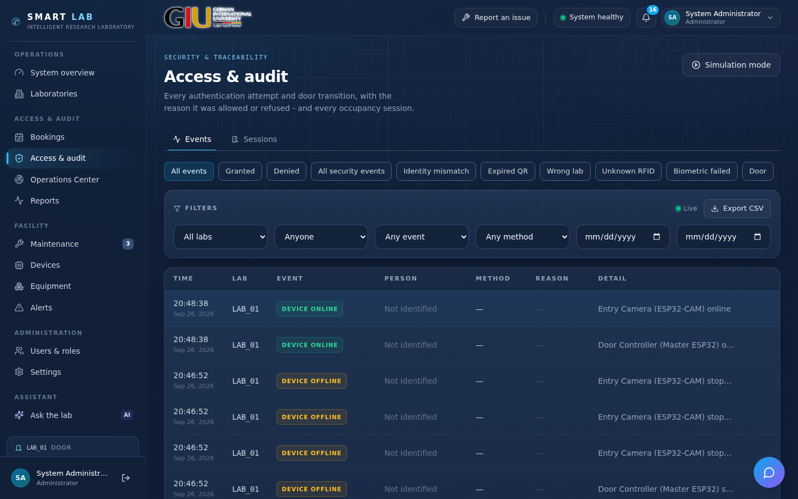 |
| **System overview (admin)** | |
| 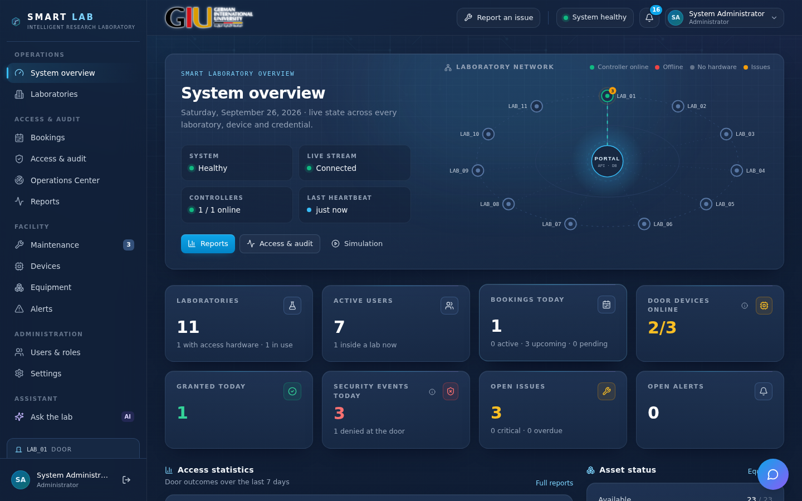 | |

## Documentation

| Document | What it covers |
|---|---|
| [ARCHITECTURE.md](docs/ARCHITECTURE.md) | components, responsibilities, the guarantees, code layout |
| [DATABASE.md](docs/DATABASE.md) | every table, indexes, migrations, safe upgrade with a backup |
| [ACCESS_FLOW.md](docs/ACCESS_FLOW.md) | booking → QR → step 1 → step 2 → relay → audit, fail-closed paths |
| [MAINTENANCE.md](docs/MAINTENANCE.md) | issue workflow, permissions, photos, dashboards, equipment lifecycle |
| [DEMO.md](docs/DEMO.md) | a 15-minute demonstration script, with and without hardware |
| [DOOR_SYSTEM.md](docs/DOOR_SYSTEM.md) | firmware, wiring, launch order, troubleshooting |
| [AI_ASSISTANT.md](docs/AI_ASSISTANT.md) | AI assistant, maintenance priority score, trends, CSV export |
| [AUTOMATION.md](docs/AUTOMATION.md) | event outbox, automation API, the 12 n8n workflows, analytics rules, failure modes |

---

## The one thing to understand first

**The backend never opens a door.**

It answers one question — *whose booking is this, and is it valid here and
now?* — and returns an identity. The ESP32 master still requires a fingerprint
or a face that matches **that** identity before it drives the relay. No HTTP
request reaches the lock.

This is what makes the system safe to put on a network. A compromised portal
can refuse entry; it cannot grant it.

The corollary is equally deliberate: when the backend is unreachable, a
booking QR **fails closed**. A laboratory that requires a booking does not
become an open door because a laptop crashed.

---

## Architecture

```
  Student's phone                Laboratory door
  ┌──────────────┐               ┌─────────────────────────────────┐
  │  Portal      │               │  ESP32-CAM ──── JPEG ───┐       │
  │  /bookings/  │  shows QR     │   (QR + frames)         │       │
  │     :id/qr   │ ────────────► │                         ▼       │
  └──────────────┘               │              Face server (Flask)│
         ▲                       │              OpenCV LBPH        │
         │ books                 │                         │       │
         │                       │  Master ESP32 ◄──────────┘       │
  ┌──────┴───────┐               │   ├── RFID  (step 1)             │
  │  FastAPI     │◄──────────────┤   ├── QR    (step 1)             │
  │  PostgreSQL  │ validate-qr   │   ├── Finger(step 2)             │
  │              │──────────────►│   ├── Face  (step 2)             │
  └──────────────┘  identity     │   └── RELAY ◄── only the master  │
         │                       └─────────────────────────────────┘
         │ events
         ▼
   Admin dashboard (live WebSocket timeline)
```

Four services, deliberately separate:

| Service | Role | Runs on |
|---|---|---|
| **PostgreSQL** | bookings, credentials, audit trail | server / laptop |
| **FastAPI backend** | authorization and logging | server / laptop |
| **React frontend** | student and admin portal | browser |
| **Flask face server** | LBPH recognition (unchanged) | the laptop by the door |

The face server stays a separate process on purpose: it is proven, it is
latency-critical, and it must keep working if the portal is down.

---

## Quick start — Docker (recommended)

One command starts the whole portal - PostgreSQL, the API and the web app:

```bash
docker compose up --build
```

On Windows, double-click **`launch.bat`** instead - it brings up everything
the door demo needs:

1. starts Docker Desktop if it is not running and waits for the engine;
2. opens the **face server** in its own window
   (`firmware\face_server\start_face_server.bat`);
3. runs that same `docker compose up --build` in its own window, with the
   logs;
4. opens <http://localhost> in the browser as soon as the portal answers,
   and prints the address for phones and for the ESP32 firmware.

`Ctrl+C` in the launcher window stops the portal and closes the face server.

The face server stays a separate Windows process on purpose - its window
shows every QR decode and face match live during a demo, and the door's face
step keeps working if the portal is stopped. It uses the `dataset\`,
`lbph_model.yml` and `labels.txt` in `firmware\face_server` (git-ignored:
they are photos of real people), and a Python with Flask and OpenCV contrib;
if none is installed, the starter sets one up once in
`firmware\face_server\.venv`.

On first start the API migrates the database and seeds the accounts,
laboratories, door devices and equipment (only what is missing; it never
invents activity). Set `SEED_DEMO_DATA=false` in `.env` to skip seeding.

| Who | Address |
|---|---|
| This laptop | <http://localhost> |
| Phones and other laptops on the same Wi-Fi or hotspot | `http://<laptop LAN IP>` - e.g. `http://192.168.1.8` |
| ESP32 master (`BACKEND_IP` in the firmware) | `<laptop LAN IP>`, port `8000` |
| API documentation | <http://localhost:8000/api/docs> |
| Database tools (pgAdmin, psql) on this laptop only | `localhost:5433`, user and database `smartlab` |

The LAN IP is the Wi-Fi adapter's `IPv4 Address` in `ipconfig` (ignore
VMware or WSL adapters). It changes when you switch networks - e.g. to a
phone hotspot - and the firmware's `BACKEND_IP` must then change with it.

Stop with `Ctrl+C` or `docker compose down`. There is one database: the
`smart-lab-portal_pgdata` volume (photos in `smart-lab-portal_uploads`). Every
start, restart and rebuild reuses it, whichever folder you launch from, and
migrations only add what is new. Only `docker compose down -v` **deletes** it.

**Before the first start:**

- Windows Home needs WSL 2 for Docker Desktop: in an Administrator
  PowerShell run `wsl --install --no-distribution`, then restart.
- Ports 80 and 8000 must be free: stop any `uvicorn` or other web server you
  started by hand.
- Optional: copy `.env.example` to `.env` to set your own `SECRET_KEY`,
  `POSTGRES_PASSWORD` and `DEVICE_API_KEY` (the firmware's `DEVICE_KEY` must
  match it). Without a `.env` the development defaults are used.
- To reach the portal from a phone, allow it through Windows Firewall once
  (Administrator prompt), and set the Wi-Fi connection's network profile to
  **Private**:

  ```bat
  netsh advfirewall firewall add rule name="Smart Lab Portal" dir=in action=allow protocol=TCP localport=80,8000,5000 profile=private
  ```

  Port 5000 is the face server, which runs outside Docker on purpose (see
  [DOOR_SYSTEM.md](docs/DOOR_SYSTEM.md)).

The Docker database is its own volume. It does not share data with a
PostgreSQL installed directly on the machine.

### Optional: n8n automation

The normal start does not run n8n; the portal never depends on it. To add it:

```bash
# .env: AUTOMATION_API_KEY, AUTOMATION_WEBHOOK_BASE=http://n8n:5678/webhook,
#       AUTOMATION_WEBHOOK_TOKEN, N8N_ENCRYPTION_KEY  (see .env.example)
docker compose --profile automation up -d --build
docker compose --profile automation exec n8n n8n import:workflow --separate --input=/workflows
```

n8n then runs at http://localhost:5678. Create the two credentials, activate
the workflows, and watch them in **Operations Center → Automation**. The full
steps, security boundary and verification results are in
[docs/AUTOMATION.md](docs/AUTOMATION.md).

**Graphify** is used only as an architecture map of this repository for the
thesis (point it at the GitHub repo). No runtime part of the portal depends on
it, and no Graphify key is stored here. See docs/AUTOMATION.md §8.

## Development without Docker

For working on the code with hot reload (and for running the tests). Needs
Python 3.11+, Node 20+, PostgreSQL 14+.

```bash
# 1. database
createdb smartlab

# 2. backend
cd backend
python -m venv .venv && source .venv/bin/activate   # Windows: .venv\Scripts\activate
pip install -r requirements.txt
cp .env.example .env                                 # edit DATABASE_URL
alembic upgrade head
python seed.py
uvicorn app.main:app --reload --host 0.0.0.0 --port 8000

# 3. frontend (second terminal)
cd frontend
npm install
npm run dev
```

Open <http://localhost:5173>.

**Upgrading an existing database:** always run `alembic upgrade head` after
pulling. The API and `seed.py` refuse to start against a migrated database
that is behind the code, and print that command, rather than half-creating
new tables.

### Sign in

| Email | Password | Role |
|---|---|---|
| `admin@giu-uni.de` | `Admin#2026` | Administrator |
| `ali@giu-uni.de` | `Student#2026` | Student (`USER1`) |
| `ramy@giu-uni.de` | `Staff#2026` | Lab staff (`USER2`) |

**Change these before the system goes anywhere real.**

---

## The identity bridge

`users.auth_subject` is the join between this database and the embedded
system. It must be identical in three places:

| Where | What it is |
|---|---|
| `users.auth_subject` in PostgreSQL | `USER1` |
| `authorizedUsers[].name` in the master firmware | `"USER1"` |
| the label in `dataset/` on the face server | `USER1` |

If these drift, step 2 can never be matched against step 1 and every entry is
refused. That is the correct failure direction, but it is confusing to debug —
check this first if a valid booking is being denied.

---

## Complete flow: booking to door

1. Student logs in, picks a laboratory, date and time window, states a purpose.
2. Backend checks conflicts, confirms the booking, and issues an opaque token:
   `SLB:<22 random characters>`. It contains no name, lab or time — everything
   that decides validity is looked up server-side at the moment of the scan.
3. Student opens the QR page at the door.
4. ESP32-CAM captures a frame and POSTs it to the face server, which decodes
   the QR with `cv2.QRCodeDetector`.
5. Master polls the camera's `/status`, sees a payload starting with `SLB:`,
   and calls `POST /api/access/validate-qr` with its `LAB_ID`.
6. Backend checks: token exists, not revoked, booking confirmed and not
   cancelled, booking belongs to *this* laboratory, current time inside the
   window, user active. Any failure returns an explicit reason and is logged.
7. On success it returns `auth_subject` — **one** identity.
8. Master requires a fingerprint or face matching that identity. A mismatch is
   logged as `IDENTITY_MISMATCH` and the door stays shut.
9. Only then does the master drive the relay, and report `ACCESS_GRANTED`.
10. Door open and close events are reported as they happen. The admin timeline
    shows the whole sequence live.

---

## Traceability: entry is not exit

Opening a booking in the portal shows the whole session, reconstructed from
the door's own events: the credential and how often it was accepted, step 1
(QR or RFID) and the identity it resolved to, step 2 (face or fingerprint)
and its identity, the result with the refusal reason if any, the first entry
compared with the booked start, and the door opening and closing - every
step timestamped to the second.

**The door has no exit reader**, so the portal does not pretend to know when
someone left. The door closing a few seconds after entry is recorded as part
of the entry, *not* as an exit (earlier versions ended the session there,
which made every visit look seconds long). A session ends with an observed
exit (`EXIT_RECORDED`, which the device API already accepts), with the
booking window closing, or with the door never being opened, and the portal
states which. Duration inside is shown only when an exit was actually
recorded.

## Maintenance and issue reporting

Anyone can report a laboratory problem - damaged, missing, malfunctioning,
unsafe, software, network or access-control hardware - with photos, in about
a minute. Reports arrive pre-filled from wherever the person started (a lab,
an equipment item, a door device, a refused access event).

- **Tickets** are numbered `ISS-YYYY-NNNNNN` and linked to the laboratory and,
  where relevant, the equipment item, device or access event - each link
  validated to belong to that laboratory.
- **Workflow:** open -> acknowledged -> in progress <-> waiting for parts ->
  resolved (notes required) -> closed (administrators), with rejection and
  reopening. Every change writes a history row: the reporter's timeline and
  the audit trail are the same records.
- **Photos** are validated by decoding them (not by extension), rotated
  upright, stripped of metadata including GPS position, scaled and
  thumbnailed, and served only to people allowed to see the issue.
  Maintenance photos are stored as *before*/*after* next to, never over, the
  reporter's photos. Storage sits behind an interface: local disk now,
  S3/MinIO later without schema changes.
- **Permissions are enforced by the API:** students see only their own
  reports (others are a 404), cannot move them through the workflow, and
  never see staff-internal notes.
- **Service levels** make "overdue" a published rule (critical 24 h, high 72 h,
  medium 7 days, low 14 days, configurable).
- **Notifications** in the portal for new and critical reports, assignment,
  escalation, and every status change the reporter should know about.

---

## Security properties, and how each is enforced

| Property | Where it is enforced |
|---|---|
| A photographed QR is useless outside its window | `validate_qr` compares against the live booking every scan |
| A QR for one lab will not open another | token carries `lab_id`; checked before the time window |
| Cancelling kills the credential immediately | `cancel_booking` revokes the token, not just the booking |
| A stolen card plus the thief's face is refused | master compares the biometric to the step-1 identity |
| The backend cannot open a door | no endpoint touches the relay; the firmware never calls `setRelay()` from network code |
| A dead backend does not open doors | `validateQrWithBackend` returns invalid on any failure |
| Students cannot see each other's bookings | ownership check returns **404**, not 403 — existence is private |
| Passwords are never stored | bcrypt via passlib |
| No biometric material in the database | templates stay in the AS608; face images stay in `dataset/` |
| Students cannot read other people's activity | lab activity, the live WebSocket stream and issue lists are scoped server-side |
| The live stream is not a side door | the WebSocket requires the same JWT as the REST API |
| Issue photos are not public files | served only through authenticated routes; EXIF/GPS stripped on upload |

Every one of these has a test. See below.

---

## Tests

```bash
cd backend
pip install -r requirements-dev.txt
createdb smartlab_test                  # the suite drops and recreates every table in it
DATABASE_URL=postgresql+psycopg://postgres:<password>@localhost:5432/smartlab_test \
  python -m pytest tests/ -q
```

Use a dedicated test database, never your real one. GitHub Actions runs the
same suite against a PostgreSQL service container on every push.

**157 tests, against real PostgreSQL** — not SQLite, because `TIMESTAMPTZ`
comparison is precisely what must not be tested on a different engine than
production runs.

- `test_authorization.py` — every non-negotiable rule: QR before / during /
  after its window, wrong lab, cancelled, unknown, revoked, inactive user,
  identity mismatch, booking conflicts, and role isolation between students.
- `test_qr_pipeline.py` — the hard requirement, below.
- `test_issues.py` — the maintenance workflow: scoping, validation,
  asset/lab consistency, photo validation and privacy, transitions, the
  ordered audit trail, internal notes, links to equipment and labs.
- `test_traceability.py` — the door closing is never an exit, full booking
  traces, supersession and booking-end handling.
- `test_portal.py` — availability without identities, role scoping,
  notifications, device offline detection, and WebSocket authentication and
  cross-thread delivery.
- `test_lifecycle.py` — equipment holder, inspections and maintenance due,
  the lifecycle timeline, access-session detail and event → session lookup,
  RFID entries without a booking, and the staff notifications (pending
  bookings, security events, cancellations, new reports).

### Navigation in a real browser

```bash
cd frontend
npm run test:e2e            # E2E_CPU_THROTTLE=6 to emulate a slow machine
```

Signs in as each role and walks every route - sidebar clicks, the student
journey from laboratory to QR, rapid clicking, back/forward, direct URLs,
reloads and an expired session - failing on any blank or invisible page,
error screen or console error. CI runs it against the production build.

```bash
npm run test:e2e:workflows  # writes test data: use the CI or a QA database
```

The things people actually do, through the UI: a student books through the
wizard and opens the QR; staff book for a student; a student reports an
issue with a photo; staff acknowledge, assign, add an internal note and an
"after" photo, and resolve; the admin closes and reopens; the student never
sees the internal note and is notified. It also runs a simulation (and fails
if that touches the API), opens an access session, and checks key pages at
phone width for sideways scrolling.

### End-to-end

With an API running **against a QA database** (it writes a booking and door
events to whatever database that API uses):

```bash
E2E_API=http://127.0.0.1:8001/api python tests/e2e_booking_to_door.py
```

Drives the live API over HTTP as the real components do — student logs in and
books, the QR is decoded with **real OpenCV**, the master validates it with a
device key, biometrics are reported, and the audit trail is checked for all
ten expected event types. 30 assertions.

### The QR requirement is actually tested

The camera never sees the PNG. It sees a phone screen through an OV2640,
JPEG-compressed at quality 12, at VGA, slightly off-axis. So the tests push
the rendered credential through that whole chain and decode it with the same
`cv2.QRCodeDetector` the face server uses — across distance, tilt, JPEG
quality and lighting.

Three findings came out of building it, all worth reporting in the thesis:

**Token length is an optical decision, not a cryptographic one.**

| Token | Payload | QR version | Modules | px/module at 260px |
|---|---|---|---|---|
| 32 bytes | 47 chars | 5 | 45 | 5.78 |
| **16 bytes** | **26 chars** | **3** | **37** | **7.03** |

22% more pixels per module is the difference between reliable and intermittent
decoding. 128 bits of entropy is still overwhelming for a credential that
expires within hours — guessing one is not the threat model, photographing one
is, and that is handled by the time window.

**Moiré, not weak signal, causes isolated decode failures.** At particular
distances the QR's module grid beats against the sensor grid and that frame is
undecodable — *more* blur fixes it, because blur is an anti-alias filter. It
does not matter in operation because the camera analyzes ~4 frames a second
while the person moves. It matters for tests, which is why they measure a
success rate across distances rather than asserting one lucky frame.

**Some valid QR codes are unreadable to the decoder.** With OpenCV 4.10 -
the decoder the face server runs - about 1 in 150 random tokens (0.66% over
5,000) renders to a QR that `cv2.QRCodeDetector` cannot read even from a
perfect image. It is a combination of data and mask pattern, not one bad
mask: each of those tokens decodes under 7 of the 8 masks. Unhandled, one
booking in 150 would get a credential the door can never open. Tokens are
random anyway, so every token is now decoded with that same detector before
it is issued, and an unreadable one is simply drawn again
(`app/services/qr.py`).

Measured from an actual browser render at phone resolution: **28/28** across
seven distances × four degradation settings.

---

## Firmware

`firmware/SmartLab_Master_Portal/` is the master with portal integration.
The pre-portal sketch is untouched and remains the fallback.

Credentials are kept out of the repository. In each sketch folder, copy
`secrets.example.h` to `secrets.h` (gitignored) and fill it in:

```cpp
const char *WIFI_SSID  = "your-2.4GHz-network";
const char *WIFI_PASS  = "your-wifi-password";
const char *DEVICE_KEY = "...";          // master only; must match DEVICE_API_KEY
```

Then set these near the top of the master sketch:

```cpp
constexpr bool BACKEND_ENABLED = true;   // false = exactly the old behaviour
const char *BACKEND_IP   = "192.168.1.8";
const char *LAB_ID       = "LAB_01";     // must match labs.code
const char *DEVICE_ID    = "MASTER_LAB01";
```

What changed, and nothing else:

- portal configuration block
- `validateQrWithBackend()` — fails closed on every error path
- `reportEvent()` / `sendHeartbeat()` — fire and forget, never block the door
- the `STATE_IDLE` QR branch now distinguishes `SLB:` tokens from legacy
  payloads; legacy still works locally so the bench demo survives the portal
  being off

The device API also accepts, without firmware changes being required:

- an `EXIT_RECORDED` event (for a future exit button or reader), which is
  the only thing that gives a session an exit time;
- optional `components` in the heartbeat, e.g.
  `{"rfid": true, "fingerprint": true, "relay_locked": true}`. Until the
  firmware sends them, the portal labels those states "not reported" instead
  of inferring them.

What did **not** change, verified by diff: all 26 safety-critical constants
(pins, `RELAY_LOCKED_LEVEL = HIGH`, `DENY_ALERT_ENABLED = false`, freshness
windows, timeouts), and the relay write sites — still exactly two, both in the
state machine, neither reachable from network code.

---

## Known limitations — state these rather than hide them

1. **No liveness detection.** A printed photo authenticates as that person.
   Inherent to LBPH. Mitigated structurally: face is only the *second* factor,
   so an attacker needs the physical credential **and** a photo of that
   specific person.
2. **Recognition depends on the laptop.** By design — the classic ESP32 cannot
   run face recognition at usable speed.
3. **No sensor node yet.** `POST /api/access/telemetry` accepts readings and
   the lab page, Operations Center and threshold workflow use them, but no
   sensor hardware posts yet. The UI shows "Awaiting sensor data" rather
   than inventing values.
4. **No exit detection.** The door reports entries, not exits, so time spent
   inside is only measured once an exit reader or button reports
   `EXIT_RECORDED`. Until then the portal says an exit was not recorded.
5. **Photos on local disk.** Issue photos live in `backend/uploads` (a Docker
   volume in compose). Back it up with the database, or move to object
   storage via the storage interface.
6. **Device history.** The portal keeps each device's latest heartbeat and
   its online/offline events, not a heartbeat time series. The Operations
   Center draws only the outages it observed; it does not claim an uptime
   percentage.
7. **Denial buzzer disabled in firmware.** Energizing it sags the 12V rail
   enough to drop the relay. Fix is a 470–1000 µF capacitor across the rail;
   see `docs/DOOR_SYSTEM.md`.
8. **Development server.** `uvicorn` directly and Flask's dev server are fine
   for a laboratory on a private LAN. A public deployment wants a proper WSGI
   or ASGI server behind TLS.

---

## Repository layout

```
smart-lab-portal/
├── backend/          FastAPI, SQLAlchemy, Alembic, tests
│   ├── app/
│   │   ├── api/routes/    auth, labs, bookings, access (device), admin,
│   │   │                  issues, notifications, system, analytics,
│   │   │                  automation (n8n)
│   │   ├── core/          config, security
│   │   ├── models/        22 tables
│   │   ├── services/      access, booking, sessions, issues, storage,
│   │   │                  notifications, devices, automation, analytics,
│   │   │                  integration (outbox)  ← the rules live here
│   │   └── ws/            authenticated live stream
│   ├── alembic/      migrations (checked against the models in CI)
│   └── tests/        157 tests + 30 end-to-end assertions
├── frontend/         React 18, TypeScript, Vite, Tailwind
│   └── e2e/          real-browser navigation and workflow tests
├── firmware/         master (portal), camera, face server
├── automation/n8n/   12 workflow sources (n8n SDK), manifest, export script
├── docs/             architecture, database, access flow, maintenance,
│                     demo script, door subsystem, screenshots
├── .github/workflows CI: backend tests, migrations, build, browser test
└── docker-compose.yml
```

---

## Author

**Ali Loay** — [@aliloay](https://github.com/aliloay)
Bachelor thesis, German International University, Cairo.
