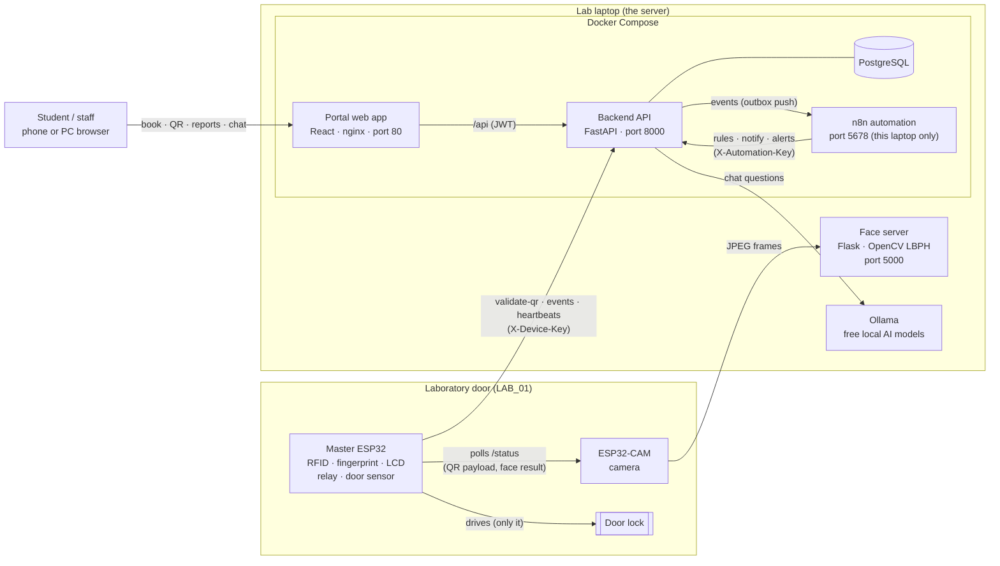
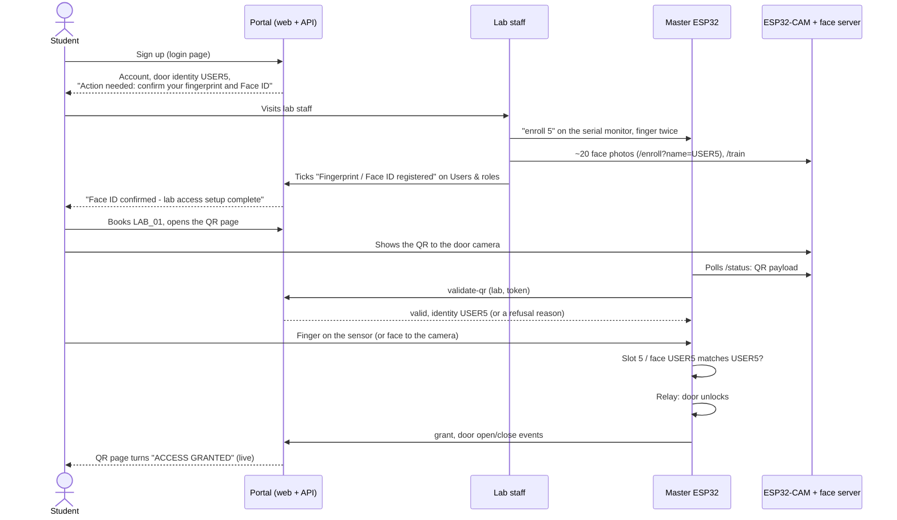

# Smart Lab Management System — how it all fits together

One page that walks through every layer, from the two ESP32 boards at the
door to the n8n automation and the AI chat, and then follows real journeys
through all of them. Each section links to the detailed document.

- [The big picture](#the-big-picture)
- [Layer by layer](#layer-by-layer)
  1. [Master ESP32 — the door controller](#1-master-esp32--the-door-controller)
  2. [ESP32-CAM — the eyes at the door](#2-esp32-cam--the-eyes-at-the-door)
  3. [Face server — on the laptop](#3-face-server--on-the-laptop)
  4. [The laptop server — Docker, launch.bat, Ollama](#4-the-laptop-server--docker-launchbat-ollama)
  5. [Backend — FastAPI](#5-backend--fastapi)
  6. [Database — PostgreSQL](#6-database--postgresql)
  7. [Frontend — the portal](#7-frontend--the-portal)
  8. [n8n — automation](#8-n8n--automation)
  9. [AI assistants — free local models](#9-ai-assistants--free-local-models)
- [Journeys through the system](#journeys-through-the-system)
- [Security boundaries](#security-boundaries)
- [Ports and addresses](#ports-and-addresses)

---

## The big picture

Three rules hold everywhere:

1. **Only the Master ESP32 opens the door.** No network message can reach the
   lock. The portal answers one question — *whose booking is this, and is it
   valid here and now?* — and the master still demands a matching biometric.
2. **The portal never invents data.** Charts count recorded rows; missing
   data says "not recorded" or "no data".
3. **Optional layers stay optional.** n8n and the AI can be off or broken and
   booking, QR codes and the door keep working.

---

## Layer by layer

### 1. Master ESP32 — the door controller

`firmware/SmartLab_Master_Portal/` · details in [DOOR_SYSTEM.md](DOOR_SYSTEM.md)

The only device that can unlock the door. It carries the MFRC522 RFID reader,
the AS608 fingerprint reader, the ST7735 colour screen, the relay for the
lock, the MC-38 door sensor and the LEDs.

It runs a state machine: **idle → step 1 → step 2 → granted → door open →
closed → relocked**.

- **Step 1: who is this?**
  - **RFID card or tag**, checked against the cards listed in the sketch.
  - **Or a booking QR code**, read by the ESP32-CAM. The master sends the QR
    to the portal (`POST /api/access/validate-qr`), and the portal replies
    with the one identity it belongs to (`USER1`, `USER2`, …) or a refusal
    reason.
- **Step 2: prove it.**
  - A **fingerprint**, which must be in *that* person's slot on the sensor.
  - **Or a face** that the face server recognises as *that* person.
  - Anyone else's finger or face is `IDENTITY_MISMATCH`.
- **Grant.** Only then does it drive the relay, show the grant screen and
  report the entry.
- **Fail closed.** If the portal cannot be reached, a booking QR is refused.
- **Reporting.** It sends a heartbeat every 30 s with component health, and
  every door event (open, close, held open, forced entry). It never waits for
  the portal before deciding.
- **New people.** A portal identity `USERn` uses fingerprint slot *n* and
  face label `USERn`. The serial monitor accepts `enroll n`, `delete n` and
  `count` for fingerprints.

### 2. ESP32-CAM — the eyes at the door

`firmware/ESP32CAM_Vision_FAST/`

- Captures frames and sends them to the face server on the laptop.
- The replies give it the latest **QR payload** and **face result**
  (`USER1`, distance…).
- It serves these on `/status`, which the master polls.
- It decides nothing about access.
- Face photos for a new person are collected through its `/enroll?name=USERn`
  page.

### 3. Face server — on the laptop

`firmware/face_server/face_server.py`

- A small **Flask** app on port 5000, started by `launch.bat` in its own
  window.
- Decodes QR codes and recognises faces with **OpenCV LBPH**, trained on the
  photos in `dataset/USERn/`.
- Endpoints: `/enroll`, `/train`, `/recognize`, `/users`, `/health`.
- Kept separate from the portal on purpose. It is latency-critical and keeps
  working when the portal is down.
- Face images stay here; the portal never stores them.

### 4. The laptop server — Docker, launch.bat, Ollama

Double-click **`launch.bat`**. It:

1. Starts Docker Desktop if needed.
2. Opens the face server window.
3. Starts **Ollama** (the free local AI) if it is installed, and downloads
   its two models the first time.
4. Runs `docker compose up --build`: PostgreSQL, the backend (it runs
   database migrations and the seed first), the portal web app behind nginx,
   and **n8n** when `.env` enables automation.
5. Prints the addresses to use (this laptop, phones on the same Wi-Fi, and
   the IP to put in both ESP32 sketches), then opens the browser.

`test_automation.bat` checks the automation end to end (key, n8n, the four
event workflows and the runs they report back).

### 5. Backend — FastAPI

`backend/app/` · details in [ARCHITECTURE.md](ARCHITECTURE.md), [ACCESS_FLOW.md](ACCESS_FLOW.md)

The business authority. Every rule lives in `services/`, so it applies the
same way to the portal, the door and n8n.

| Area | What it does |
|---|---|
| **Accounts** | Sign in (JWT). Self sign-up (students only). Admin-created student, staff and admin accounts. Every new account gets the next **door identity** `USERn`, and numbers are never reused. |
| **Lab access setup** | Tells people whose fingerprint or Face ID is not registered yet: a notification, a banner after each sign-in, and a Profile checklist. Staff tick it off on *Users & roles*. **Information only: the door never reads it.** |
| **Bookings** | 11 labs, conflict detection, maximum length, approval or auto-confirm, cancellation, reminders before the start. |
| **QR credentials** | One time-bound token per booking, valid only for that lab and that window. Every token is checked to be readable by the door camera before it is shown. |
| **Access (device API)** | `validate-qr`, `validate-rfid`, `grant`, `deny`, events and heartbeats, protected by `X-Device-Key`. Records every attempt with its reason. |
| **Sessions & trace** | Rebuilds each booking to the second: both factors, result, entry and door cycle. An exit appears only when one was recorded. |
| **Maintenance** | Issues with photos, tickets, SLA, assignment, history. Equipment lifecycle and inspections. |
| **Devices & alerts** | Heartbeats, component health, offline detection, forced entry and door held open. |
| **Notifications & live stream** | In-portal notifications and an authenticated WebSocket, published only after the database commit. |
| **Analytics** | Operations Center aggregates, week-over-week trends, no-show and late-arrival rates, CSV export. |
| **Automation API** | The rules n8n calls (`/api/automation/*`, `X-Automation-Key`), plus the **event outbox** that feeds n8n. |
| **AI** | The staff and student assistants (read-only), plus the deterministic "what to fix first" maintenance score. |

### 6. Database — PostgreSQL

`backend/app/models/tables.py` · details in [DATABASE.md](DATABASE.md)

Users (with `auth_subject` and the enrolment dates), labs, devices, RFID
credentials, bookings, QR tokens, access attempts and events (the audit
trail), access sessions, issues with photos and history, assets,
notifications, alerts, sensor readings, `integration_events` (the outbox) and
the audit log.

Schema changes go through **Alembic** migrations, and the API refuses to start
on an out-of-date database. Only the *fact* that a biometric is enrolled is
stored, never the biometric itself.

### 7. Frontend — the portal

`frontend/src/` · React + TypeScript + Tailwind + Recharts

| Role | Main screens |
|---|---|
| **Student** | dashboard (next booking, recent activity, "my lab time" chart), laboratories, new booking, my bookings with the live **QR** page, report an issue, my reports, notifications, profile with the **lab access setup** checklist |
| **Lab staff** | operations dashboard, reservations, access monitor, **Operations Center**, maintenance queue, devices, equipment, alerts |
| **Admin** | everything staff see, plus **system overview** (laboratory network map), reports, **Users & roles** (add student/staff/admin, door identity, biometrics registered), settings, simulation |

Dashboards and diagrams:
- **System overview:** a live network map of the 11 labs and door controller
  status.
- **Operations Center:**
  - utilisation by lab, and weekday × hour heatmaps for bookings and entries;
  - the access funnel, refusal reasons, and granted/denied per day;
  - sessions, device outages, maintenance flow against the SLA, and
    environment readings;
  - automation status and week-over-week trends;
  - the "what to fix first" list, CSV and print export, and the AI panel.
- **Reports:** usage and access charts over 7/30/90 days or a year.
- **Lab page:** that lab's usage pattern.

Every page has loading, empty and error states. Every route is exercised in a
real browser in CI.

The **AI chat** is always one click away: the round button in the
bottom-right corner, or **Ask the lab / Ask Smart Lab** in the sidebar.

### 8. n8n — automation

`automation/n8n/` · details in [AUTOMATION.md](AUTOMATION.md)

- n8n runs next to the portal (Docker profile `automation`, port 5678, this
  laptop only).
- The backend writes an **event** in the same database transaction as every
  change (the *outbox*). A dispatcher pushes selected events to n8n webhooks
  with a token, retrying until they are delivered.
- n8n then calls the automation API for the **rules**, which live in the
  backend, and creates notifications, alerts and run records. Every write has
  a dedupe key, so a retry never creates duplicates.

| # | Workflow | Trigger | What it does |
|---|---|---|---|
| 01 | Booking confirmation | event | pre-visit briefing with the lab's readiness |
| 02 | Upcoming reminders | schedule | reminder before each booking |
| 03 | Access denial intelligence | event | detects refusal bursts, alerts staff |
| 04 | Device offline escalation | event | escalates an offline controller L1 → L3 |
| 05 | Maintenance automation | event + daily | flags HIGH/CRITICAL issues in booked labs; daily digest |
| 06 | Daily report | schedule | the day's usage, access and maintenance |
| 07 | Weekly report | schedule | week vs last week, optional AI summary |
| 08 | Sensor thresholds | schedule | environment readings out of range |
| 09 | Pre-booking check | schedule | warns about a lab that is not ready (never cancels) |
| 10 | Post-session follow-up | schedule | asks for a problem report after a session |
| 11 | Data quality | schedule | read-only consistency checks |
| 12 | Anomaly detection | schedule | after-hours access, repeated mismatches, flapping devices |

**n8n can never open or lock a door or cancel a booking.** If it is down,
events wait and are delivered later.

### 9. AI assistants — free local models

`backend/app/services/ai.py`, `ai_guide.py` · details in [AI_ASSISTANT.md](AI_ASSISTANT.md)

| | Staff / admin — "Ask the lab" | Students — "Ask Smart Lab" |
|---|---|---|
| Model (free, Ollama) | `qwen2.5:3b` | `qwen2.5:1.5b` |
| How it answers | Calls **read-only tools**: overview, trends, reports, maintenance priorities, open issues, anomalies, lab readiness. Every number comes from the database. | Reads a context the backend prepares: only **this student's** bookings, reports, recent door attempts (with the refusal reason in plain words) and lab access setup, plus the lab list with times already booked (never who booked them). |
| Knows how the system works | yes | yes |
| Can change anything | no | no |

Both assistants share the same short guide to the system: booking, QR and
RFID, registering a fingerprint and Face ID, what each refusal means, and the
door, camera and n8n. That's how a student can ask "why isn't my QR code
working?" or "how do I register my face?" and get a real answer. The guide
contains no addresses, keys or passwords.

- **Where the models run:** both stay loaded on the laptop's GPU and are
  loaded when the portal starts.
- **Paid alternative:** Claude can be used instead by adding a key.
- **Limits:** questions have an hourly limit per user, and every question is
  audited.

---

## Journeys through the system

### A new student, from sign-up to inside the lab

### A refused attempt becomes an alert

1. The master reports `deny`, and the backend records the reason and writes an
   outbox event in the same transaction.
2. The dispatcher pushes `access.denied` to n8n workflow 03.
3. Workflow 03 asks the backend whether this is a burst (3 refusals in 10 min).
4. If it is, one alert plus one notification per staff member is created; a
   retry changes nothing.

### A broken machine

A student uses **Report an issue** with photos. Staff are notified, the issue
gets a ticket and an SLA, and it appears in **what to fix first**, ranked by
severity, SLA, safety, assignment and upcoming bookings. n8n workflow 05
warns staff at once if a HIGH or CRITICAL issue is in a lab booked within
24 h.

### A question to the chat

- **Student:** "Why doesn't my QR work?" The backend adds their recent door
  attempts, for example *"The booking window has not opened yet."*, and their
  booking times. The model explains in two or three sentences.
- **Admin:** "How busy were the labs this week?" The model calls the trends
  and report tools and answers with the recorded numbers.

---

## Security boundaries

| Boundary | Protection |
|---|---|
| People → API | JWT, passwords hashed with bcrypt, role checks, students see only their own data (404 otherwise) |
| Door → API | `X-Device-Key`, constant-time comparison |
| n8n → API | `X-Automation-Key` (503 when unset); webhooks need `X-Smartlab-Token` |
| API → door | none: no endpoint reaches the relay |
| AI | read-only tools; hourly limits; audited; user-written text treated as data; no secrets in its guide |
| Portal down | booking QR refused (fails closed) |
| Biometrics | fingerprint templates stay in the sensor, face images on the face server |

---

## Ports and addresses

| Port | Service | Reached by |
|---|---|---|
| 80 | Portal (nginx → web app, `/api` → backend) | browsers, phones on the Wi-Fi |
| 8000 | Backend API | the Master ESP32 |
| 5000 | Face server | the ESP32-CAM |
| 5678 | n8n | this laptop only |
| 11434 | Ollama | this laptop only (the backend reaches it through Docker) |
| 5433 | PostgreSQL | this laptop only (pgAdmin, backups) |

`launch.bat` prints the laptop's Wi-Fi address to put in both sketches
(`BACKEND_IP` in the master, `SERVER_IP` in the camera).
